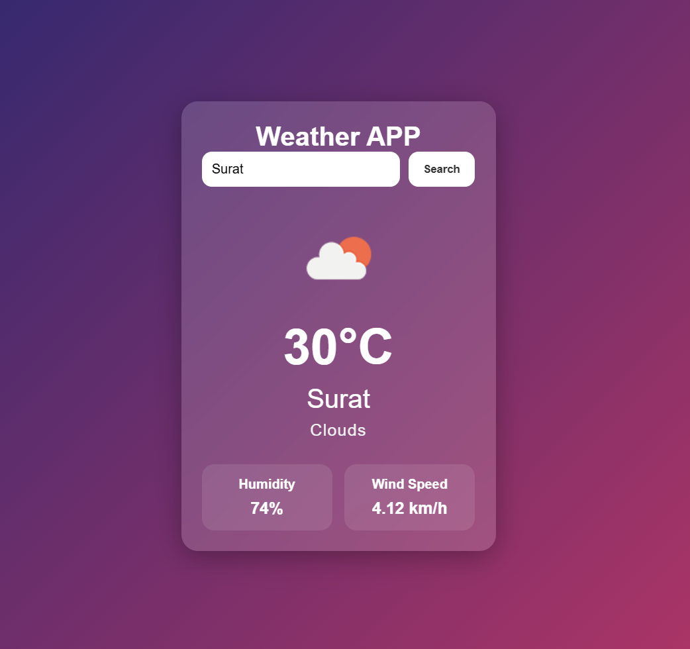

# Weather App

A modern weather application built using HTML, CSS, and JavaScript.

## Features

- Search weather by city
- Real-time temperature
- Weather conditions
- Humidity and wind speed
- Dynamic weather icons
- Responsive modern UI

## Technologies Used

- HTML
- CSS
- JavaScript
- OpenWeather API

## Live Demo

https://sumermal.github.io/weather-app/

## Screenshot

## How to Run

1. Clone the repository
2. Open index.html in browser

## API Used

OpenWeather API
